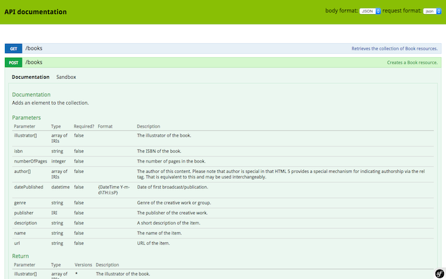

# DunglasApiBundle

DunglasApiBundle is an easy to use and powerful system to create [hypermedia-driven REST APIs](http://en.wikipedia.org/wiki/HATEOAS).
It is a component of the [Dunglas's API Platform framework](https://github.com/dunglas/api-platform) and it can be used
as a standalone bundle for [the Symfony framework](http://symfony.com).

It embraces [JSON for Linked Data (JSON-LD)](http://json-ld.org) and [Hydra Core Vocabulary](http://www.hydra-cg.com) web standards. 

Build a working and fully-featured CRUD API in minutes. Leverage the awesome features of the tool to develop complex and
high performance API-first projects.

## Features

Here is the fully-featured REST API you'll get in minutes, I promise:

* CRUD support through the API for Doctrine entities: list, `GET`, `POST`, `PUT` and `DELETE`
* Hypermedia implementing [JSON-LD](http://json-ld.org)
* Machine-readable documentation of the API in the [Hydra](http://hydra-cg.com) format, guessed from PHPDoc, Serializer,
Validator and Doctrine ORM metadata
* Human-readable Swagger-like documentation including a sandbox automatically generated thanks to the integration with
[NelmioApiDoc](https://github.com/nelmio/NelmioApiDocBundle)
* Pagination (compliant with Hydra)
* List filters (compliant with Hydra)
* Validation using the Symfony Validator Component, with groups support
* Errors serialization (compliant with Hydra)
* Custom serialization using the Symfony Serializer Component, with groups support and the possibility to embed relations
* Automatic routes registration
* Automatic entrypoint generation giving access to all resources
* `\DateTime` serialization and deserialization
* [FOSUserBundle](https://github.com/FriendsOfSymfony/FOSUserBundle) integration (user management)
* Easy installation thanks to API Platform

Everything is fully customizable through a powerful event system and strong OOP.
This bundle is documented and tested with Behat (take a look at [the `features/` directory](features/)).

## Official documentation

1. [Getting Started](Resources/doc/getting-started.md)
  1. [Installing DunglasApiBundle](Resources/doc/getting-started.md#installing-dunglasapibundle)
  2. [Configuring the API](Resources/doc/getting-started.md#configuring-the-api)
  3. [Mapping the entities](Resources/doc/getting-started.md#mapping-the-entities)
  4. [Registering the services](Resources/doc/getting-started.md#registering-the-services)
2. [NelmioApiDocBundle integration](Resources/doc/nelmio-api-doc.md)
3. [Operations](Resources/doc/operations.md)
  1. [Disabling operations](Resources/doc/operations.md#disabling-operations)
  2. [Creating custom operations](Resources/doc/operations.md#creating-custom-operations)
4. [Data providers](Resources/doc/data-providers.md)
  1. [Creating a custom data provider](Resources/doc/data-providers.md#creating-a-custom-data-provider)
  2. [Returning a paged collection](Resources/doc/data-providers.md#returning-a-paged-collection)
  3. [Supporting filters](Resources/doc/data-providers.md#Supporting-filters)
5. [Filters](Resources/doc/filters.md)
  1. [Search filter](Resources/doc/filters.md#search-filter)
  2. [Date filter](Resources/doc/filters.md#date-filter)
    1. [Managing `null` values](Resources/doc/filters.md#managing-null-values)
  3. [Order filter](Resources/doc/filters.md#order-filter)
    1. [Using a custom order query parameter name](Resources/doc/filters.md#using-a-custom-order-query-parameter-name)
  4. [Enabling a filter for all properties of a resource](Resources/doc/filters.md#enabling-a-filter-for-all-properties-of-a-resource)
  5. [Creating custom filters](Resources/doc/filters.md#creating-custom-filters)
    1. [Creating custom Doctrine ORM filters](Resources/doc/filters.md#creating-custom-doctrine-orm-filters)
    2. [Overriding extraction of properties from the request](Resources/doc/filters.md#overriding-extraction-of-properties-from-the-request)
6. [Serialization groups and relations](Resources/doc/serialization-groups-and-relations.md)
  1. [Using serialization groups](Resources/doc/serialization-groups-and-relations.md#using-serialization-groups)
  2. [Annotations](Resources/doc/serialization-groups-and-relations.md#annotations)
  3. [Embedding relations](Resources/doc/serialization-groups-and-relations.md#embedding-relations)
    1. [Normalization](Resources/doc/serialization-groups-and-relations.md#normalization)
    2. [Denormalization](Resources/doc/serialization-groups-and-relations.md#denormalization)
  4. [Name conversion](Resources/doc/serialization-groups-and-relations.md#name-conversion)
7. [Validation](Resources/doc/validation.md)
  1. [Using validation groups](Resources/doc/validation.md#using-validation-groups)
8. [The event system](Resources/doc/the-event-system.md)
  1. [Retrieving list](Resources/doc/the-event-system.md#retrieving-list)
  2. [Retrieving item](Resources/doc/the-event-system.md#retrieving-item)
  3. [Creating item](Resources/doc/the-event-system.md#creating-item)
  4. [Updating item](Resources/doc/the-event-system.md#updating-item)
  5. [Deleting item](Resources/doc/the-event-system.md#deleting-item)
  6. [Registering an event listener](Resources/doc/the-event-system.md#registering-an-event-listener)
9. [Resources](Resources/doc/resources.md)
  1. [Using a custom `Resource` class](Resources/doc/resources.md#using-a-custom-resource-class)
10. [Controllers](Resources/doc/controllers.md)
  1. [Using a custom controller](Resources/doc/controllers.md#using-a-custom-controller)
11. [FOSUserBundle integration](Resources/doc/fosuser-bundle.md#fosuser-bundle-integration)
12. [Using external (JSON-LD) vocabularies](Resources/doc/external-vocabularies.md)
13. [Performances](Resources/doc/performances.md)
  1. [Enabling the metadata cache](Resources/doc/performances.md#enabling-the-metadata-cache)
14. [AngularJS integration](Resources/doc/angular-integration.md)

## Other resources

* (french) [A la découverte de API Platform (Symfony Paris Live 2015)](http://dunglas.fr/2015/04/mes-slides-du-symfony-live-2015-a-la-decouverte-de-api-platform/)
* (french) [API-first et Linked Data avec Symfony (sfPot Lille 2015)](http://les-tilleuls.coop/slides/dunglas/slides-sfPot-2015-01-15/#/)

## Credits

DunglasApiBundle is part of the API Platform project. It is developed by [Kévin Dunglas](http://dunglas.fr),
[Les-Tilleuls.coop](http://les-tilleuls.coop) and [awesome contributors](https://github.com/dunglas/DunglasApiBundle/graphs/contributors).
